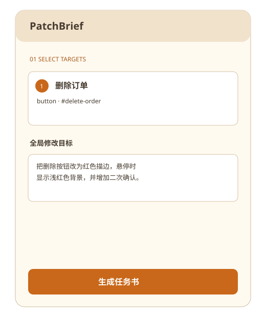

# SpotBrief · 视觉修改任务书

> 在网页上选择修改位置，填写要求、相关代码和约束，一键生成可交给 AI 编码助手的结构化前端修改任务书。



SpotBrief 是无后端、无登录的 JavaScript Bookmarklet。它不会读取本地源码或自动修改代码。默认流程完全在本地运行；只有用户主动配置 API 并勾选“使用 AI 优化任务书”时，才会向该 API 发起请求。

## 安装与使用

部署或本地打开 `dist/index.html`，等待“书签已准备好”，把 SpotBrief 按钮拖到浏览器书签栏。打开普通 HTTP(S) 网页或 localhost，点击书签，悬停预览、点击锁定，填写任务后生成、复制或下载 Markdown。

“相关代码”和“修改约束”默认收起，点击标题即可展开；五项安全约束会默认勾选。“预期结果”已合并进全局修改目标、元素说明和截图说明，不再单独填写。

快捷键：Shift+点击多选；Esc 清空/暂停；Ctrl/Cmd+Z 撤销；Ctrl/Cmd+Enter 生成。输入框聚焦时不会劫持普通按键。

面板中的“截取页面区域”会请求浏览器共享权限。请选择当前标签页，然后在当前可见网页上按住鼠标拖出矩形；成功后可以在图片下方填写截图说明，并预览、复制或下载 PNG，截图文件名、尺寸和说明会进入任务书。截图不上传、不写入 localStorage，关闭工具后即从内存清除。

桌面网页上可以按住面板顶栏的空白区域拖动工作台，位置会保存到 SpotBrief 自身设置；顶栏的 `⌂` 可恢复右上角。窄屏继续使用底部抽屉，不启用自由拖动。

## 可选 AI 指令优化

安装页可以保存 OpenAI-compatible API 的 Base URL、模型名称和 API Key。配置只保存在安装页所属域名的浏览器存储中，API Key 不会写入书签或任务书。保存后需要重新把 SpotBrief 按钮拖到书签栏，以更新 AI 设置页的配对信息。

任务面板默认仍生成本地任务书。勾选“使用 AI 优化任务书”后，SpotBrief 会打开设置页作为桥接窗口，将经过清理的 Markdown 任务书交给用户配置的 API 改写。AI 调用失败、配置缺失或弹窗被拦截时，保留本地任务书并显示错误。

本地生成器会识别“高级一点”“好看一点”“大气”等主观表达。无法从用户要求中获得客观标准时，任务书会增加“待确认”，禁止编码助手自行指定颜色、阴影、渐变或视觉风格。

## 示例输出

```markdown
# Frontend Change Brief
## 修改目标
把删除按钮改成红色描边样式。
## 选中目标
### 目标 1
- 元素：删除订单
- Selector：#delete-order
- 语义定位：button "删除订单"
```

## 隐私

默认处理发生在当前页面。工具不读取 Cookie、网络请求、其他 localStorage 内容或本地文件。用户代码、选区、任务要求和截图默认不持久化；HTML 摘要会移除输入值、脚本、事件属性和敏感数据。启用 AI 优化时，清理后的任务书会发送到用户配置的 API；API Key 由安装页独立保存。

## 支持与限制

Chrome 和 Edge 是完整功能基线；Firefox 与 Safari 支持核心流程，但剪贴板和截图能力可能降级。浏览器禁止 Bookmarklet 在 `chrome://`、`edge://`、扩展商店和新标签内部页运行。跨域 iframe 只能选择 iframe 本身；关闭的 Shadow Root 无法检查内部元素。截图必须由用户主动授权并选择当前标签页，只能框选当前视口，不能静默截图或生成整页长截图。

## 本地开发

需要 Node.js 20+ 与 pnpm 11：

```bash
pnpm install --frozen-lockfile
pnpm typecheck
pnpm test
pnpm build
pnpm verify
pnpm exec playwright install chromium
pnpm test:e2e
```

构建产物位于 `dist/`。运行 `npx serve .` 后访问 `/dist/` 可预览安装页。GitHub Pages 在仓库设置中选择 GitHub Actions，推送到 `main` 后由 `deploy-pages.yml` 发布。所有资源使用相对路径，兼容项目子目录。

## 开源

SpotBrief 使用 [MIT License](LICENSE)。实现为原创代码；未复制参考项目代码，生产运行时无第三方依赖。贡献方式见 [CONTRIBUTING.md](CONTRIBUTING.md)，安全问题见 [SECURITY.md](SECURITY.md)。
